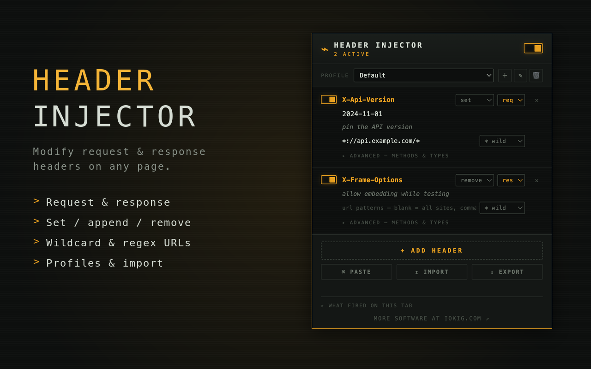

  

# Header Injector

A Chrome extension (Manifest V3) that adds, modifies, and removes HTTP
**request and response** headers on the pages your browser loads. Each header is
a rule you can toggle on and off individually, plus a master switch to bypass
everything at once.

Uses the `declarativeNetRequest` API, so headers are applied by the browser's
network stack itself — no request interception scripts, works on all resource
types (pages, XHR/fetch, images, websockets, etc.).

Product page: **[iokig.com/header-injector](https://www.iokig.com/header-injector)**

  

## Install

Install it free from the
**[Chrome Web Store](https://chromewebstore.google.com/detail/lmenpgenoahfecdigodcalifmnmdlffo)**.

To run it from source for development:

1. Open `chrome://extensions`
2. Enable **Developer mode** (top-right toggle)
3. Click **Load unpacked** and select this folder

## Use

- Click the extension icon to open the panel
- **+ ADD HEADER** to create a rule
- Each row has:
  - **name / value** — the header and its value
  - **operation** — `set` (add or overwrite), `append` (add another value), or
    `remove` (strip the header). `remove` hides the value field.
  - **target** — apply to the outgoing **request** (`req`) or the incoming
    **response** (`res`)
  - a **description** — free-text note, just for you; it doesn't affect anything
  - **url patterns** — where this rule applies. Leave blank for every site, or
    enter comma-separated patterns. Toggle `* wild` / `.* regex` to interpret
    them as wildcards (e.g. `*://*.example.com/*`) or regular expressions.
  - **advanced** — restrict the rule to specific HTTP **methods** and/or
    **resource types** (document, XHR, script, image, …). Nothing selected
    means all methods / all types.
- Each row has its own toggle; the switch in the title bar disables everything
- The badge on the icon shows how many rules are currently enabled
- Changes apply immediately — reload the page you're testing to see them

### Profiles

Group rules into named **profiles** and switch between them from the dropdown —
handy for keeping separate `dev` / `staging` / `prod` header sets. Only the
active profile's rules are applied. Use the ＋ / ✎ / 🗑 buttons to add, rename,
or delete profiles.

### Paste headers or curl

**⌘ PASTE** opens a box where you can paste either a block of `Name: Value`
lines (straight from DevTools) or a full `curl` command — the `-H` / `--header`
values are parsed into rows automatically.

### What fired on this tab

Expand **what fired on this tab** to see which of your rules matched requests on
the current page (best-effort, via `declarativeNetRequest` matched-rule
feedback). Reload the tab, then refresh the list.

### Import / Export

- **EXPORT** downloads all your profiles and rules as `header-injector-export.json`
- **IMPORT** reads a JSON file. Shapes auto-detected:
  - this extension's own export — a full profile set is added as new profiles;
    an older single-list export is appended to the active profile
  - a profiles-style export from another header tool — header
    names/values/enabled state carry over, a per-header `comment` becomes the
    description, and any plain URL filters are brought across. "Append" headers
    are imported as "set", and regex URL filters that don't map to wildcard
    patterns are left blank (all sites).

Older configurations (from before profiles) are migrated automatically into a
"Default" profile the first time you open the panel — nothing is lost.

Notes:

- Header names must be valid HTTP token characters (letters, digits, `-`, etc.);
  invalid names turn red and are skipped
- Headers are stored in `chrome.storage.sync`, so they follow your Chrome profile
- Injected headers are visible to every site you visit while enabled — turn the
  master switch off when you're done testing

## License

[MIT](LICENSE) © Samuel Lastrina. Free to use, including commercially — just
keep the copyright and license notice when you redistribute or build on it.
